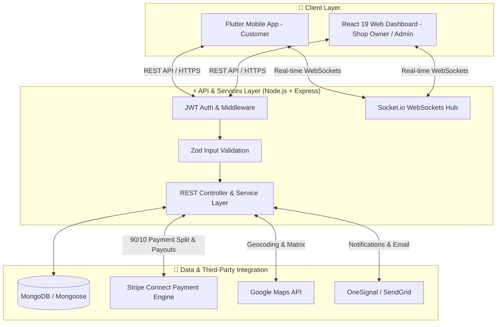

# GRABBY — Smart Café Pre-Ordering, Car Pickup & Multi-Tenant Platform (Client: ayah_almheiri)

[](https://nodejs.org/)
[](https://www.typescriptlang.org/)
[](https://expressjs.com/)
[](https://www.mongodb.com/)
[](https://flutter.dev/)
[](https://react.dev/)
[](https://tailwindcss.com/)
[](https://stripe.com/)
[](https://socket.io/)

---

## 📌 Executive Summary & Project Overview

**Grabby** is an enterprise-grade, multi-tenant digital café ordering and store management ecosystem designed to revolutionize how customers purchase food and beverages from local cafés. By bridging the gap between mobile ordering, real-time arrival tracking, automated payment distribution, and store operations, Grabby eliminates wait times and empowers café owners with automated revenue generation.

The platform provides a seamless end-to-end workflow consisting of:
1. **📱 Customer Mobile App (Flutter)**: Allows customers to discover nearby cafés, pre-order food & coffee, choose between **Car Pickup** (with real-time arrival alerts) or **Counter Pickup**, pay securely, earn digital loyalty stamps, and track orders in real-time.
2. **💻 Admin & Merchant Dashboard (React 19 + TypeScript + Vite)**: Gives store owners and super-admins an interactive control panel for live order processing, store branch setup, menu editing, marketing campaign bidding, customer analytics, fee split management, and content publishing.
3. **⚡ High-Performance Backend (Node.js + Express + MongoDB)**: A robust RESTful API & WebSockets server powered by TypeScript, strict Zod validation, JWT authentication, Winston logging, and automated **Stripe Connect 90/10 commission split**.

---

## 🌟 Key Features & Business Capabilities

### 📱 1. Customer Mobile Experience (Flutter App)
* **📍 Smart Café Discovery**: Interactive Map and List view powered by Google Maps API to search nearby cafés, check opening hours, and browse menus.
* **🚗 Car Pickup & Multi-Vehicle Management**: Register multiple vehicle license plates and select **Car Pickup** at checkout. The app uses geofenced arrival tracking to notify the café when the customer arrives within a predefined radius.
* **☕ Digital Loyalty Stamp Rewards System**: Earn automated digital stamps for coffee purchases per branch. Accumulated stamps can be redeemed in-app for free menu items.
* **💳 Seamless In-App Payment**: Integrated with **Stripe Connect** and **Foloosi** for instant card payments and tokenized checkout.
* **🗺️ Integrated Live Navigation**: Direct Google Maps turn-by-turn navigation route from current location to café branch.
* **📜 Order History & Refund Wallet**: Full visibility into past orders, digital receipts, and structured refund requests (full or partial refund converted to in-app wallet credit).
* **💡 Shop Suggestion System**: Submit requests for favorite local cafés to join the Grabby network.

---

### 🏪 2. Shop Owner Management (Dashboard & App)
* **🚀 Merchant Self-Onboarding**: Cafés can register independently, upload business credentials, and link their **Stripe Connect** Express/Custom payout accounts.
* **🏢 Multi-Branch Management**: Add, update, and monitor multiple café locations and operating schedules under a single business account.
* **📦 Live Order Kanban & Kitchen Processing**: Real-time incoming order audio alerts and status lifecycle management (`Pending` ➔ `Preparing` ➔ `Ready for Pickup` ➔ `Completed`).
* **🍽️ Dynamic Menu Editor**: Manage product categories, prices, modifier groups, add-on options, stock availability, and image assets.
* **📢 Marketing Campaign Bidding**: Participate in featured placement promotional tiers to boost shop visibility on the customer home feed.
* **💰 Automated Payouts**: 90% of order revenue is automatically routed to the Shop Owner's Stripe Connect account, while 10% is allocated as platform service commission.

---

### 👑 3. Super Admin & Platform Operations (Dashboard)
* **📊 Business Intelligence & Revenue Analytics**: Interactive charts powered by Recharts showing total revenue, gross commission earned, order volumes, and customer growth.
* **👥 User & Merchant Governance**: Moderate store onboarding requests, review shop performance metrics, manage fee overrides, and lock/unlock accounts.
* **💸 Dispute & Refund Oversight**: Evaluate pending refund requests, issue customer wallet credits, and resolve store disputes.
* **📝 Dynamic Content Management (CMS)**: Integrated **Tiptap Rich-Text Editor** allowing admins to update Terms & Conditions, Privacy Policy, FAQs, and About Us pages live without code deployment.

---

## 🏗️ System Architecture & Workflow



---

## 🛠️ Technology Stack Breakdown

| Layer | Technologies Used | Description / Purpose |
| :--- | :--- | :--- |
| **Mobile App** | `Flutter (Dart)`, `BLoC Pattern`, `GoRouter` | Cross-platform iOS & Android customer mobile app |
| **Mobile Native Tools** | `Google Maps Flutter`, `Geolocator`, `Socket.io Client` | Navigation, geofencing, real-time arrival alerts |
| **Web Dashboard** | `React 19`, `TypeScript`, `Vite 7`, `Tailwind CSS 4` | Fast, modern admin & merchant control panel |
| **UI Components** | `Shadcn UI`, `Radix UI`, `TanStack Table`, `Recharts` | Accessible components, data tables, analytical charts |
| **Rich-Text Editor** | `Tiptap Editor` | Dynamic CMS editing for Terms, Privacy, FAQ pages |
| **Backend Runtime** | `Node.js (>=16)`, `TypeScript`, `Express.js` | RESTful API server with strict typing |
| **Database & ODM** | `MongoDB`, `Mongoose ODM` | NoSQL document store with schema modeling |
| **Payments** | `Stripe Connect API (SDK v15)` | Automated 90/10 commission split & shop payouts |
| **Real-time WebSockets**| `Socket.io` | Bi-directional messaging for arrival notifications & live order tracking |
| **Validation & Security**| `Zod`, `JWT (JSON Web Tokens)`, `bcrypt` | Request schema validation & password encryption |
| **Logging & Queues** | `Winston`, `Bull Queue` | Rotation logs & async background worker queues |

---

## 📂 Workspace Monorepo Structure

```text
grabby/
├── 📁 grabby_backend/          # Node.js + Express + TypeScript REST API & Real-time WebSockets Server
│   ├── 📁 src/
│   │   ├── 📁 app/
│   │   │   ├── 📁 builder/     # QueryBuilder for filtering, sorting, pagination
│   │   │   ├── 📁 config/      # Environment variables & constants
│   │   │   ├── 📁 errors/      # Global error handler & AppError class
│   │   │   ├── 📁 middlewares/ # Auth, Zod validation, file upload
│   │   │   ├── 📁 modules/     # Feature Modules (Auth, Order, Shop, Menu, Stamp, Stripe, Admin)
│   │   │   └── 📁 routes/      # Main API router registration
│   │   ├── 📁 enums/           # User roles, order status, payment status enums
│   │   ├── 📁 interfaces/      # TypeScript type definitions
│   │   └── 📄 server.ts        # Express app entry point & WebSockets listener
│   ├── 📄 Requirements.md      # Detailed system requirement specs
│   ├── 📄 stripe.md            # Stripe Connect integration architecture
│   └── 📄 package.json         # Node.js dependencies & run scripts
│
├── 📁 grabby_dashboard/        # React 19 + TypeScript + Vite + Tailwind Dashboard
│   ├── 📁 src/
│   │   ├── 📁 app/             # Page views (Dashboard, Management, Settings, Notifications)
│   │   ├── 📁 components/      # Reusable UI components, modals, TanStack columns
│   │   ├── 📁 hooks/           # Custom React hooks (useSmartFetchHook, etc.)
│   │   ├── 📁 layout/          # Main App Layout & Auth Layout wrappers
│   │   ├── 📁 router/          # Protected & public router configuration
│   │   └── 📁 services/        # API service clients for HTTP communication
│   ├── 📄 vite.config.ts       # Vite build configuration
│   └── 📄 package.json         # Dashboard dependencies
│
└── 📁 grabby_app/              # Flutter Cross-Platform Mobile Application
    ├── 📁 lib/                 # Dart source code (Screens, Widgets, BLoC/State Management)
    ├── 📁 assets/              # App images, icons, custom SVGs
    └── 📄 pubspec.yaml         # Flutter packages & assets declaration
```

---

## 💡 Key Architectural & Technical Highlights

### 1. 💳 Stripe Connect 90/10 Automated Revenue Split
The backend leverages **Stripe Connect Direct Charges / Transfer Data** to automatically split incoming payments:
* **90%** of total order payment is immediately transferred to the merchant's connected Stripe account.
* **10%** is collected as the platform fee (`application_fee_amount`) in the Super Admin's Stripe account.
* **Stripe Onboarding**: Shop owners trigger an account link onboarding flow directly from their management dashboard to start receiving payouts.

```typescript
// Example snippet of payment intent creation with commission split
const paymentIntent = await stripe.paymentIntents.create({
  amount: Math.round(totalPrice * 100), // In cents
  currency: 'usd',
  payment_method_types: ['card'],
  application_fee_amount: Math.round(totalPrice * 0.10 * 100), // 10% Platform Fee
  transfer_data: {
    destination: shopStripeAccountId, // 90% Payout to Shop Owner
  },
});
```

---

### 2. ⚡ Real-Time Socket.io Arrival & Order Updates
When a customer approaches the café branch for a **Car Pickup**:
1. The mobile app's `Geolocator` calculates distance relative to the store coordinates.
2. Upon reaching the threshold (e.g., `< 200 meters`), a WebSockets event `customer:arrived` is dispatched.
3. The merchant dashboard receives a real-time event, triggering an audible chime and displaying the car plate number for car-side delivery.

---

### 3. 🎯 Digital Stamp & Free Menu Item Engine
* Customers earn 1 digital loyalty stamp per qualifying beverage ordered at a specific branch.
* When stamp count reaches the threshold configured by the store (e.g., 5 stamps = 1 free item), the system generates a free menu claim token via the `/api/v1/stamps/check-free-item` API.

---

## ⚙️ Getting Started & Local Setup

### 📋 Prerequisites
Ensure you have the following installed on your developer machine:
- **Node.js**: `v16.0.0` or higher
- **npm** or **pnpm** or **yarn**
- **Flutter SDK**: `v3.10.0` or higher
- **MongoDB**: Local instance or MongoDB Atlas Connection URI
- **Stripe Account**: API Keys (Secret Key, Publishable Key, Client ID for Connect)

---

### ⚡ 1. Backend Server Setup (`grabby_backend`)

```bash
# Navigate to backend directory
cd grabby_backend

# Install dependencies
npm install

# Create environment configuration
cp .env.example .env
```

Configure your `.env` file with the required credentials:
```env
PORT=5000
NODE_ENV=development
DATABASE_URL=mongodb://localhost:27017/grabby_db
BCRYPT_SALT_ROUNDS=12
JWT_SECRET=your_super_secret_jwt_key
JWT_EXPIRES_IN=7d
STRIPE_SECRET_KEY=sk_test_...
STRIPE_WEBHOOK_SECRET=whsec_...
```

Run the development server:
```bash
# Start backend in dev mode with live reload
npm run dev

# Build TypeScript to dist
npm run build

# Start production server
npm start
```

---

### 💻 2. Web Dashboard Setup (`grabby_dashboard`)

```bash
# Navigate to dashboard directory
cd grabby_dashboard

# Install dependencies with pnpm
pnpm install

# Start Vite dev server
pnpm dev
```
The dashboard will launch locally at `http://localhost:5173`.

---

### 📱 3. Mobile App Setup (`grabby_app`)

```bash
# Navigate to mobile app directory
cd grabby_app

# Fetch Flutter dependencies
flutter pub get

# Run on connected device or emulator
flutter run
```

---

## 🌐 Core API Routes Overview

| Method | Endpoint Path | Description | Access Level |
| :--- | :--- | :--- | :--- |
| `POST` | `/api/v1/auth/register` | Register new user account | Public |
| `POST` | `/api/v1/auth/login` | User authentication & JWT issuance | Public |
| `GET` | `/api/v1/shops` | List nearby cafés with filter & map params | Public / Customer |
| `POST` | `/api/v1/orders/create` | Create new order with pickup type & item list | Customer |
| `POST` | `/api/v1/stripe/create-payment-intent` | Initialize Stripe 90/10 split payment | Customer |
| `POST` | `/api/v1/stripe/onboard-shop` | Generate Stripe Connect onboarding link | Shop Owner |
| `PATCH` | `/api/v1/orders/status/:id` | Update order processing status | Shop Owner / Admin |
| `GET` | `/api/v1/stamps/check-free` | Verify stamp count & free item eligibility | Customer |
| `GET` | `/api/v1/admin/analytics` | Retrieve platform revenue & store metrics | Super Admin |
| `PUT` | `/api/v1/settings/cms` | Update dynamic Terms/Privacy/FAQ content | Admin |

---

## 📄 License & Maintainer Info

Developed for **Grabby Application**.  
Designed & Engineered with ❤️ for high scalability, real-time performance, and premium user experience.

If you have any questions or require administrative access for demonstration, please contact the development team or platform repository administrator.
